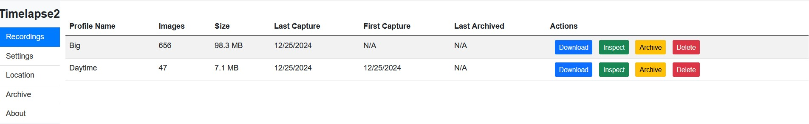
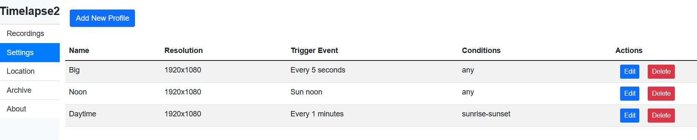
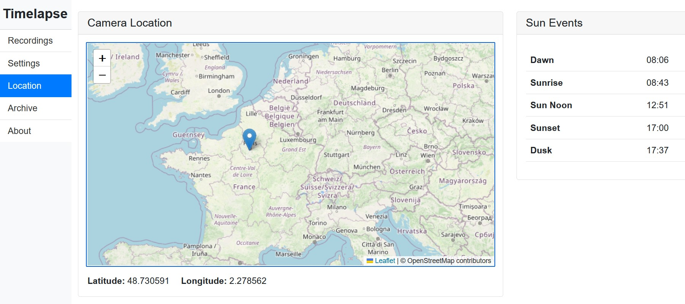
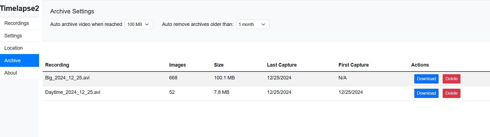

# Timelapse 2

Create timelapse videos with an Axis Camera. Typical use cases include:

- Construction site progress
- Monitoring seasonal changes or other slow-changing scenes
- Forensic search
- Event trigger validation

### [Download](https://www.dropbox.com/scl/fi/uik3zu8potr7rv7u2djyb/Timelapse2.zip?rlkey=ovo9g8sb6qwmbyzptkn6c9674&dl=1)
Pre-compiled ACAP for ARMv7-hf and AARCH64

---
If you find this ACAP valuable, please consider [buying me a coffee](https://buymeacoffee.com/fredjuhlinl).  

Please report bugs and other issues [here](https://github.com/pandosme/Timelapse2/issues)

---
## Overview

- **AXIS OS12 compliant**  
  Requires Firmware 11.11.x or greater.  If the firmware is less than 11.11.x, use TimelapseMe.
- **Panoramic cameras are not supported**
- You need to enable "Allow unsigned ACAP"
- Migration from TimelapseMe to Timelapse 2 is not possible as they are two different applications.

---

## Key Features

- Supports multiple simultaneous timelapse recordings triggered by timers or events.
- Automatic archiving based on recording size, up to 1GB.
- Automatic removal of archived recordings with a configurable retention period to reduce the risk of exhausting the SD card.
- Geolocation-based sun events to filter image captures for daytime only.
- Fires a "Sun Noon" event that can capture images daily when the sun is at its peak height. Daylight savings is managed. This feature is recommended for construction site progress.

---

## Recordings
 

A table of all active recordings.
  
### Actions

- **Download**: Download the AVI recording. A dialog will appear where you can select the playback frame rate (fps).
- **Inspect**: Open a dialog to view all captured images.
- **Archive**: Close the recording and move it to "Archive." The recording will continue capturing images.
- **Delete**: Remove all captures in the recording. The recording will continue capturing images.

---

## Settings
 

  
Add and edit timelapse profiles.
- Set a descriptive name
- Set Trigger type (Event or Timer)
- Set resolution
- Text overlay.  If text overaly is configured in the camera e.g. Date & Time, select if this shall be included in the timelapse.
- Conditions:  Setting this will supress images capture during night.  Select sunrise-sunset or dawn-dusk.

### Actions

- **Edit**: Edit the profile. This will impact the active recording associated with the profile.  
  *Note: It is not recommended to change the resolution.*
- **Delete**: Remove the profile. The recording associated with the profile will **not** be removed.

---

## Location
  

Set the geolocation of the camera. This calculates dawn, dusk, sunrise, sun noon, sunset, and dusk times. These sun events can be used to filter image captures during daytime only. Additionally, it fires a "Sun Noon" event that can capture an image when the sun is at its peak height.

Use the mouse to navigate the map and click on the location of the camera.

---

## Archive
  
  
List and fetch closed recordings.

### Settings

- **Auto archive video when size exceeds**: Recordings larger than this size will automatically move to "Archived." It is recommended to keep a moderate size.
- **Auto remove archives older than**: Archived recordings older than this set duration will be automatically removed to reduce the risk of exhausting SD card storage. Specify the number of months you may need access to archived recordings.

---

# History

### 1.0.4 - December 14, 2025
- Fixed sun recalculation.

### 1.0.3 - December 5, 2025
- Fixed a bug for sunnoon event trigger

### 1.0.2 - December 2, 2025
- Fixed a bug that after archiving a recording, the new recording was not playable.
- Fixed sun noon event
- Fixed that captures only trigger on transition to active on stateful events 

### 1.0.1 - December 26, 2024
- Bug fixes

### 1.0.0 - December 25, 2024
- Initial release

---
